# Arquitetura — Jedi Study

> Plataforma de aprendizado orientada por estado com múltiplos agentes de IA.
> Fluxo principal: **Subject → StudyPath → Phase → Task → Submission → Analysis**

---

## Índice

### Diagramas Estruturais
1. [Contexto do Sistema (C4 Level 1)](#1-contexto-do-sistema)
2. [Containers (C4 Level 2)](#2-containers)
3. [Componentes da API NestJS (C4 Level 3)](#3-componentes-da-api-nestjs)
4. [Componentes do Agents Service](#4-componentes-do-agents-service)
5. [Arquitetura do Frontend React](#5-arquitetura-do-frontend-react)
6. [Modelo de Entidades (ER)](#6-modelo-de-entidades)

### Diagramas Comportamentais
7. [Autenticação](#7-autenticação)
8. [Geração de StudyPath (Async)](#8-geração-de-studypath)
9. [Submissão de Task + Unlock de Fases](#9-submissão-de-task-e-unlock-de-fases)
10. [Geração de Conteúdo + SSE](#10-geração-de-conteúdo-e-sse)
11. [Máquina de Estados — StudyPath](#11-máquina-de-estados--studypath)
12. [Máquina de Estados — Phase](#12-máquina-de-estados--phase)
13. [Máquina de Estados — Task e Submission](#13-máquina-de-estados--task-e-submission)
14. [Máquina de Estados — AgentJob e Content](#14-máquina-de-estados--agentjob-e-content)
15. [Arquitetura de Filas BullMQ](#15-arquitetura-de-filas-bullmq)

---

## Diagramas Estruturais

---

### 1. Contexto do Sistema

> **O que é:** Visão de mais alto nível. Mostra o sistema como uma caixa preta e quem interage com ele — usuários e sistemas externos.

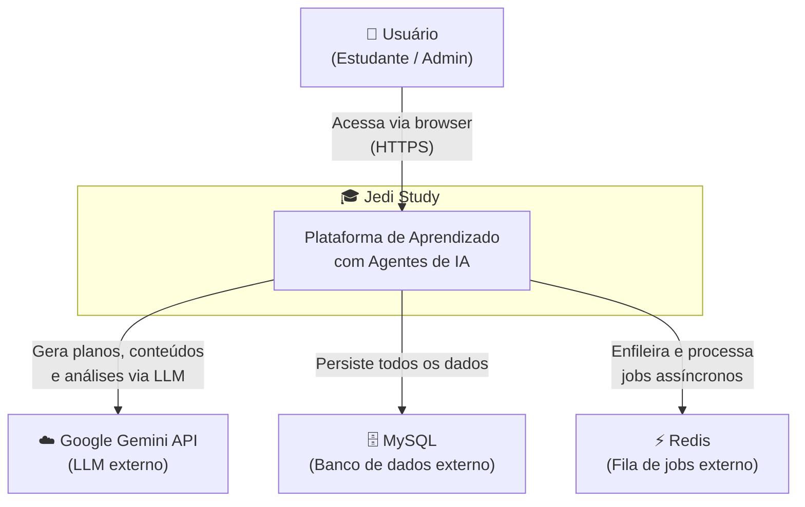

**Explicação:**
O usuário interage exclusivamente com a plataforma via browser. Toda a inteligência artificial é delegada ao **Google Gemini** via API. O **MySQL** persiste o estado de todos os recursos (subjects, paths, tasks, etc.). O **Redis** é o backbone de processamento assíncrono via BullMQ — sem ele, nenhuma geração de conteúdo ou análise acontece.

---

### 2. Containers

> **O que é:** Desmembra o sistema em processos executáveis independentes (containers). Mostra como se comunicam entre si e com os sistemas externos.

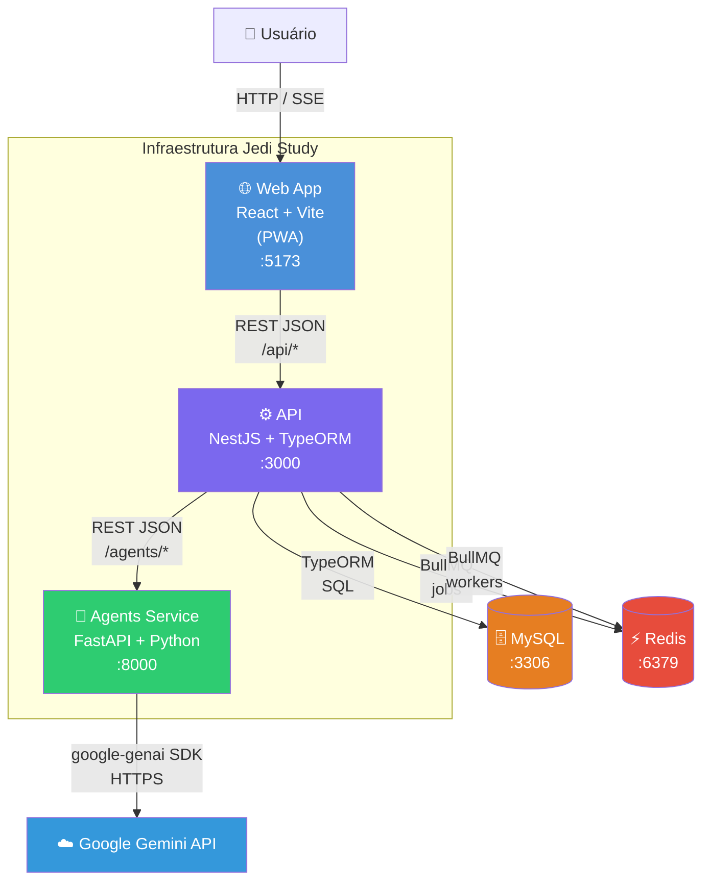

**Explicação:**
- **Web App** — PWA em React/Vite. Comunica com a API via REST. Usa Axios com interceptors para injetar JWT e unwrap respostas. Tem um endpoint SSE para streaming de conteúdo gerado.
- **API NestJS** — Coração do sistema. Gerencia autenticação, orquestra os jobs assíncronos via BullMQ, e faz a ponte entre Web e Agents. Nunca chama o Gemini diretamente.
- **Agents Service** — Serviço Python isolado. Única responsabilidade: chamar o Gemini com prompts estruturados e retornar dados validados (Pydantic). Sem banco de dados próprio.
- **MySQL** — Banco único compartilhado. Gerenciado por TypeORM com migrations. Persiste todo o estado da plataforma.
- **Redis** — Armazena as filas BullMQ. Cada tipo de job tem sua fila dedicada. A API produz os jobs; os processors da própria API os consomem.

---

### 3. Componentes da API NestJS

> **O que é:** Internamente, a API é organizada em módulos NestJS independentes. Este diagrama mostra cada módulo, suas responsabilidades e dependências.

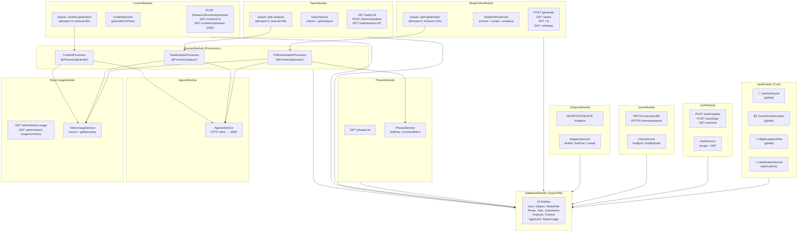

**Explicação:**
- O `JwtAuthGuard` protege todas as rotas globalmente. Rotas públicas usam o decorator `@Public()`.
- O `TransformInterceptor` encapsula todas as respostas em `{success: true, data: ...}`.
- Os **Processors** (QueuesModule) são os únicos consumidores das filas — eles chamam o `AgentsService` e registram o `TokenUsage` após cada chamada ao Gemini.
- O `PathGenerationProcessor` depende do `PhasesService` para executar a lógica de unlock após a geração do path.
- O `DatabaseModule` exporta o TypeORM para todos os outros módulos via `autoLoadEntities`.

---

### 4. Componentes do Agents Service

> **O que é:** Internamente, o Agents Service é um conjunto de 4 agentes independentes, cada um com seu router FastAPI, lógica de prompt e schema de saída.

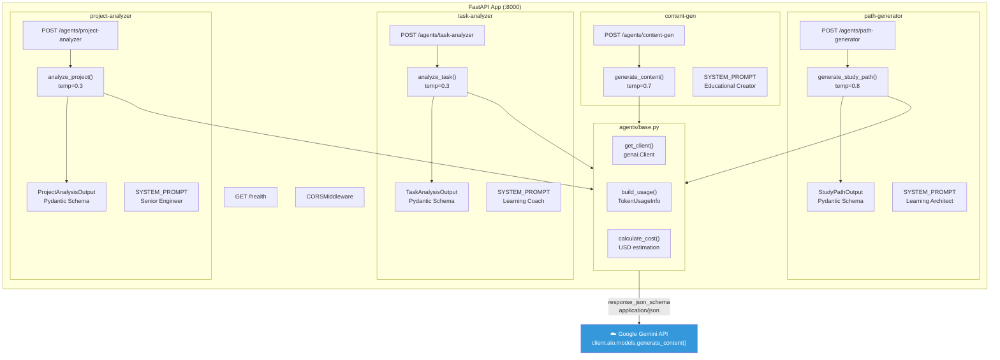

**Explicação:**
- Cada agente usa `client.aio.models.generate_content()` (async nativo via `client.aio`).
- **PathGenerator** e os analyzers usam `response_json_schema: Model.model_json_schema()` — o Gemini retorna JSON garantido conformando ao schema Pydantic, sem necessidade de parsing manual.
- **ContentGen** é o único que retorna texto livre (Markdown) — sem `response_json_schema`.
- A `temperature` é calibrada por agente: criação (0.7–0.8) vs análise (0.3) para respostas mais determinísticas.
- `build_usage()` extrai `usage_metadata` da resposta para calcular custo em USD e registrar no API.

---

### 5. Arquitetura do Frontend React

> **O que é:** Organização interna do Web App — roteamento, gerenciamento de estado e camada de API.

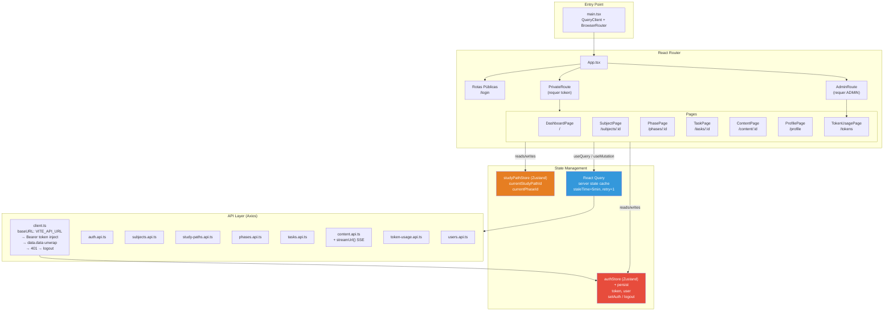

**Explicação:**
- **Zustand** gerencia apenas estado local persistente (auth token) e navegação (qual path/fase está ativa). É síncrono e sem cache.
- **React Query** gerencia todo o estado servidor — fetching, caching, invalidação. Rotas como `GET /tasks/:id` são cacheadas por 5 minutos.
- O `client.ts` tem dois interceptors: (1) injeta `Authorization: Bearer <token>` em toda requisição; (2) unwrapa `response.data.data` automaticamente (removendo o envelope `{success, data}` do `TransformInterceptor`).
- O `content.api.ts` tem um `streamUrl()` que retorna a URL do endpoint SSE com o token como query param (necessário pois `EventSource` não suporta headers customizados).

---

### 6. Modelo de Entidades

> **O que é:** Relacionamentos entre todas as entidades do banco MySQL. Mostra cardinalidade, campos principais e chaves.

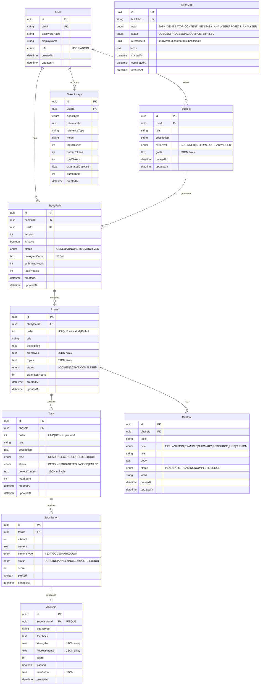

**Explicação:**
- `Subject` é o ponto de entrada do usuário. Um Subject pode ter múltiplos `StudyPath` (versionados), mas apenas um `isActive=true` por vez.
- `Phase.order` tem constraint UNIQUE com `studyPathId` — garante sequência sem gaps.
- `Task.order` tem constraint UNIQUE com `phaseId` — idem para tasks dentro de uma fase.
- `AgentJob.referenceId` é um campo polimórfico (pode apontar para `StudyPath`, `Content` ou `Submission`). Não há FK constraint — é resolvido no código pelo campo `type`.
- `Analysis` tem relação `OneToOne` com `Submission` — uma submission gera exatamente uma analysis.
- `TokenUsage` registra cada chamada ao Gemini com custo calculado, vinculado ao usuário que originou a ação.

---

## Diagramas Comportamentais

---

### 7. Autenticação

> **O que é:** Fluxo completo de registro, login e proteção de rotas via JWT.

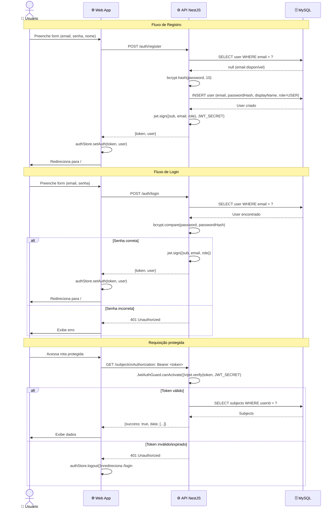

**Explicação:**
- O `JwtAuthGuard` é global — toda rota é protegida por padrão. Apenas `POST /auth/register` e `POST /auth/login` têm `@Public()`.
- O JWT carrega `{sub: userId, email, role}` e expira conforme `JWT_EXPIRES_IN` (default 24h).
- O Axios interceptor no Web App cuida automaticamente do 401 → logout → redirect.

---

### 8. Geração de StudyPath

> **O que é:** Fluxo assíncrono completo — desde o clique do usuário até as fases/tasks criadas no banco, passando pela fila BullMQ e o Agents Service.

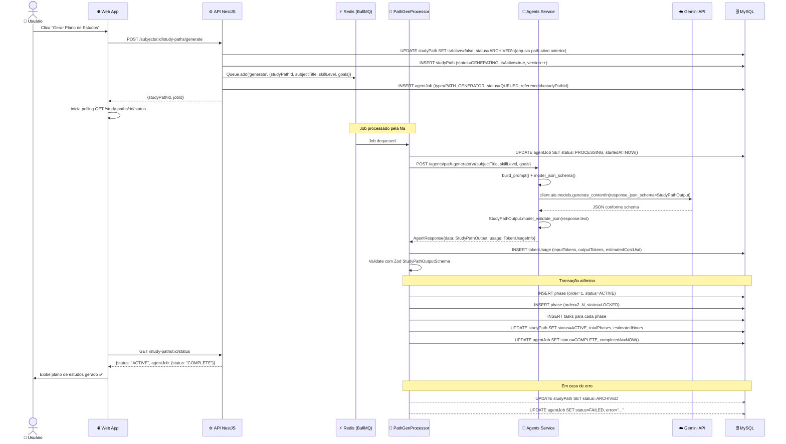

**Explicação:**
- A API retorna imediatamente com `{studyPathId}` — a geração é **100% assíncrona**.
- O Web App faz polling no endpoint de status. Quando `studyPath.status === 'ACTIVE'`, exibe o plano.
- A fase de ordem 1 nasce `ACTIVE` (desbloqueada). Todas as demais nascem `LOCKED` — o usuário deve completar sequencialmente.
- A criação de phases e tasks é feita em **transação atômica** — ou tudo é criado, ou nada.
- BullMQ tenta o job **3 vezes** com backoff exponencial antes de marcar como FAILED.

---

### 9. Submissão de Task e Unlock de Fases

> **O que é:** Fluxo de submissão de uma resposta + análise pelo agente + lógica de desbloqueio sequencial de fases.

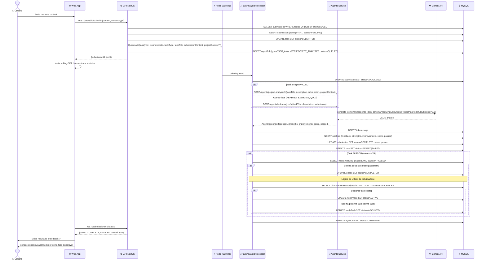

**Explicação:**
- Tasks do tipo `PROJECT` são roteadas para o `project-analyzer` (temperatura 0.3, schema diferente com `technicalAssessment` e `architectureNotes`).
- O threshold de aprovação é **70/100** — definido no system prompt dos analyzers.
- O desbloqueio é **automático e em cascata** dentro do processor — nenhuma ação manual do usuário é necessária.
- A última fase concluída muda o `StudyPath.status` para `ARCHIVED` (ciclo completo de aprendizado).
- A `attempt` em `Submission` permite múltiplas tentativas na mesma task — cada nova submissão cria um novo registro.

---

### 10. Geração de Conteúdo e SSE

> **O que é:** Fluxo de geração de conteúdo educacional com streaming de status via Server-Sent Events (SSE).

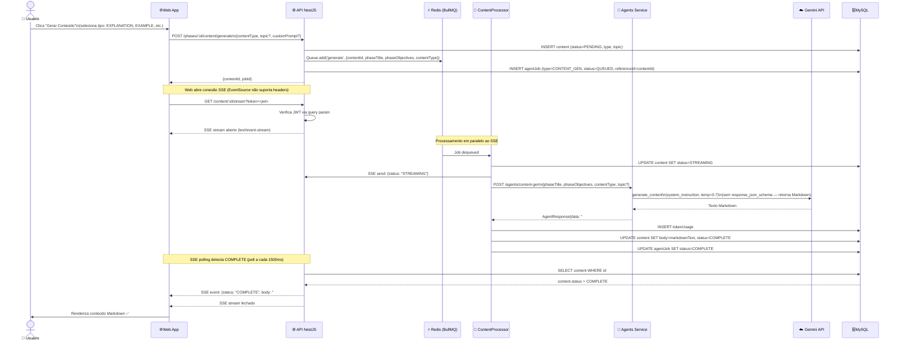

**Explicação:**
- O `EventSource` (API padrão de SSE do browser) não permite headers customizados, então o JWT é enviado como query param `?token=<jwt>` — o endpoint de stream valida dessa forma.
- O SSE faz **polling no banco a cada 1.500ms** — não é streaming real de tokens. O conteúdo completo é enviado num único evento quando o status vira `COMPLETE`.
- O `ContentGen` é o único agente que **não usa `response_json_schema`** — retorna Markdown livre, temperatura mais alta para conteúdo mais criativo.
- Tipos de conteúdo: `EXPLANATION` (conceitual), `EXAMPLE` (exemplos práticos), `SUMMARY` (revisão), `RESOURCE_LIST` (curadoria de links), `CUSTOM` (via `customPrompt`).

---

### 11. Máquina de Estados — StudyPath

> **O que é:** Todos os estados possíveis de um StudyPath e as transições entre eles.

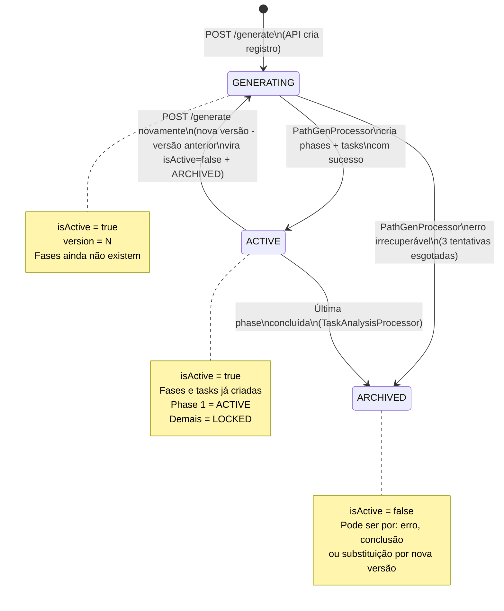

**Explicação:**
- Apenas **1 StudyPath** pode ter `isActive=true` por Subject.
- Ao gerar novamente, o path atual vira `ARCHIVED` com `isActive=false` — o histórico é preservado.
- O `ARCHIVED` por conclusão acontece quando a última fase é `COMPLETED` — o `TaskAnalysisProcessor` faz isso automaticamente.

---

### 12. Máquina de Estados — Phase

> **O que é:** Ciclo de vida de uma fase dentro do StudyPath, controlando o aprendizado sequencial.

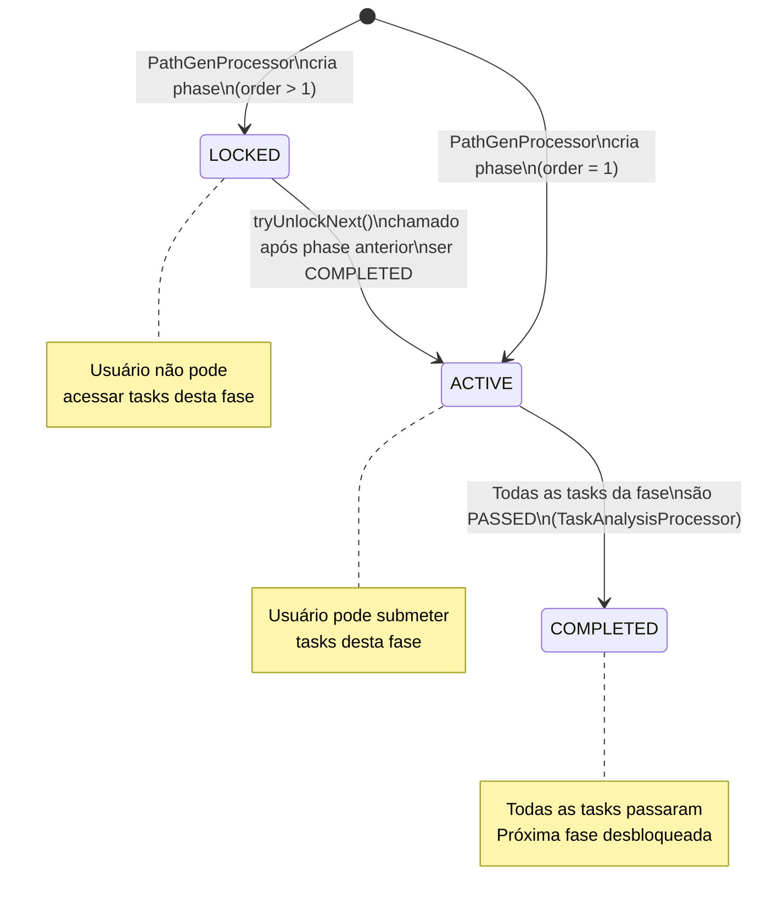

**Explicação:**
- O **sequenciamento forçado** é implementado via status `LOCKED` — o frontend bloqueia acesso a fases `LOCKED`.
- A fase de `order=1` nasce `ACTIVE` automaticamente — o usuário começa imediatamente.
- A transição `LOCKED → ACTIVE` é feita pelo `TaskAnalysisProcessor` chamando `phasesService.tryUnlockNext()`.

---

### 13. Máquina de Estados — Task e Submission

> **O que é:** Estados paralelos de Task (o enunciado) e Submission (a resposta do aluno).

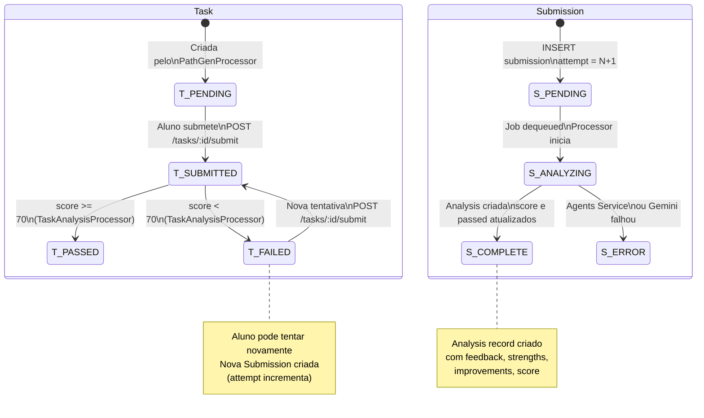

**Explicação:**
- Task e Submission têm ciclos de vida independentes — mas estão sincronizados pelo processor.
- Múltiplas `Submissions` podem existir para uma `Task` (tentativas). A API retorna apenas a **última submission** na tela da task.
- Um `Submission.status = ERROR` não impede nova tentativa — o aluno pode re-submeter.
- `Task.status = FAILED` é transitório — volta para `SUBMITTED` na próxima tentativa.

---

### 14. Máquina de Estados — AgentJob e Content

> **O que é:** Ciclo de vida dos jobs de agente (rastreamento de operações assíncronas) e do conteúdo gerado.

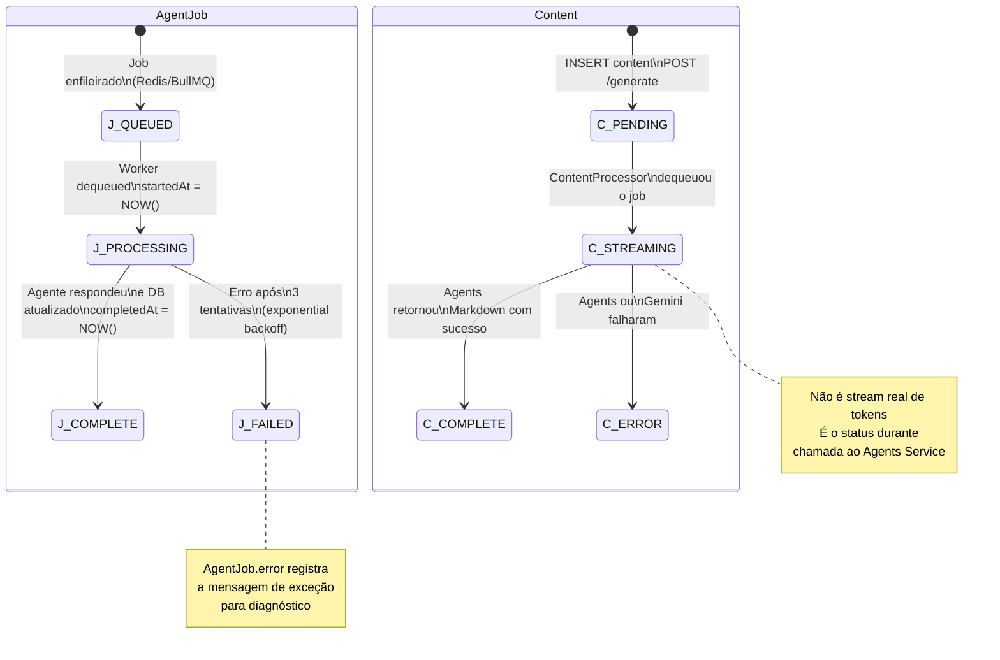

**Explicação:**
- `AgentJob` é o **registro de auditoria** de cada operação assíncrona — permite rastrear o que aconteceu, quando e com qual erro.
- O campo `referenceId` do `AgentJob` é polimórfico: aponta para `studyPathId`, `contentId` ou `submissionId` dependendo do `type`.
- O status `STREAMING` em `Content` não reflete streaming real de tokens — é apenas o período em que o `ContentProcessor` está aguardando resposta do Agents Service.

---

### 15. Arquitetura de Filas BullMQ

> **O que é:** As 3 filas BullMQ, seus producers (services da API) e consumers (processors), com os dados trafegados em cada job.

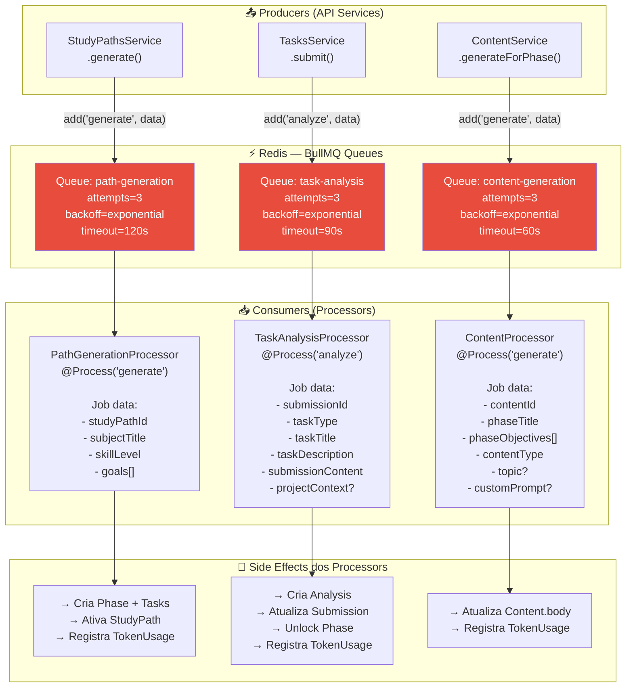

**Explicação:**
- As filas têm **timeouts diferentes** calibrados pela complexidade de cada operação: geração de path (120s) > análise de task (90s) > geração de conteúdo (60s).
- Cada processor tem **3 tentativas** com **backoff exponencial** — evita sobrecarregar o Gemini em momentos de latência.
- Os processors são os **únicos pontos** que chamam o `AgentsService` — os controllers nunca chamam o Gemini diretamente.
- O campo `bullJobId` no `AgentJob` é o ID retornado pelo BullMQ ao enfileirar, permitindo correlacionar o registro no banco com o job no Redis.

---

## Glossário de Status

| Entidade | Status possíveis |
|---|---|
| StudyPath | `GENERATING` → `ACTIVE` → `ARCHIVED` |
| Phase | `LOCKED` → `ACTIVE` → `COMPLETED` |
| Task | `PENDING` → `SUBMITTED` → `PASSED` \| `FAILED` |
| Submission | `PENDING` → `ANALYZING` → `COMPLETE` \| `ERROR` |
| Content | `PENDING` → `STREAMING` → `COMPLETE` \| `ERROR` |
| AgentJob | `QUEUED` → `PROCESSING` → `COMPLETE` \| `FAILED` |

## Stack Resumida

| Camada | Tecnologia |
|---|---|
| Frontend | React 18, Vite, Zustand, React Query, Axios |
| API | NestJS 10, TypeORM 0.3, BullMQ, Passport JWT |
| Agents | FastAPI, Python 3.13, Pydantic v2, google-genai SDK |
| LLM | Google Gemini (configurável via `GEMINI_MODEL`) |
| Banco | MySQL (migrações via TypeORM CLI) |
| Fila | Redis (BullMQ — 3 filas dedicadas) |
| Infra | Docker Compose (dev + prod), Nginx (web prod) |
